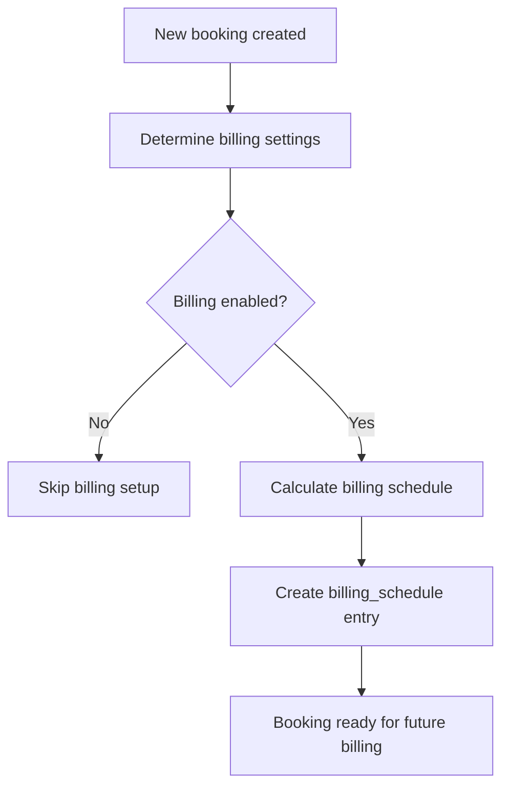
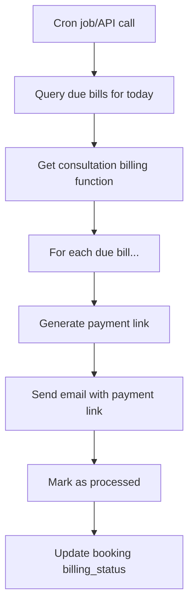
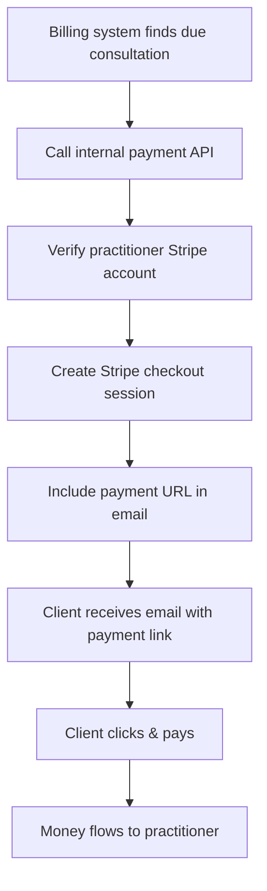

# Consultation Billing System Documentation

## 📋 Table of Contents

1. [Overview](#overview)
2. [Database Architecture](#database-architecture)
3. [Billing Flow Logic](#billing-flow-logic)
4. [API Endpoints](#api-endpoints)
5. [Email Integration](#email-integration)
6. [Payment Link Generation](#payment-link-generation)
7. [Testing & Debugging](#testing--debugging)
8. [Configuration](#configuration)
9. [Troubleshooting](#troubleshooting)
10. [Future Enhancements](#future-enhancements)

---

## 🎯 Overview

The Consultation Billing System automates the process of **billing clients for consultation appointments**. It handles both **pre-consultation** and **post-consultation** billing scenarios with automated email delivery and integrated payment links.

### Key Features

✅ **Automated Billing Schedule** - Calculates when to send bills based on consultation timing
✅ **Email Integration** - Beautiful HTML emails via Resend
✅ **Payment Links** - Integrated Stripe Connect payment processing
✅ **Flexible Triggers** - Bill before or after consultations
✅ **Bulk Processing** - Handle multiple consultations efficiently
✅ **Error Tracking** - Comprehensive logging and error handling
✅ **Dry Run Mode** - Preview emails before sending

### Business Logic

- **Before Consultation**: Bill clients X days before their appointment (requires advance payment)
- **After Consultation**: Bill clients after their appointment is completed (invoice-style billing)
- **Platform Integration**: Automatically generates payment links for each bill
- **Practitioner Branding**: Emails include practitioner details and branding

---

## 🗄️ Database Architecture

### Core Tables Relationship

```
profiles (practitioners)
    ↓
bookings ← billing_settings
    ↓
billing_schedule
    ↓
[Billing API processes due bills]
```

### 1. `billing_settings` Table

**Purpose**: Defines billing configuration for different scenarios (user defaults, client-specific, booking-specific)

```sql
CREATE TABLE billing_settings (
    id UUID DEFAULT gen_random_uuid() PRIMARY KEY,
    user_id UUID REFERENCES profiles(id) ON DELETE CASCADE NOT NULL,
    client_id UUID REFERENCES clients(id) ON DELETE CASCADE NULL,
    booking_id UUID REFERENCES bookings(id) ON DELETE CASCADE NULL,

    -- Billing configuration
    should_bill BOOLEAN DEFAULT FALSE,
    billing_amount DECIMAL(10,2),
    billing_type TEXT CHECK (billing_type IN ('recurring', 'consultation_based', 'project_based')),
    billing_frequency TEXT CHECK (billing_frequency IN ('weekly', 'monthly', 'quarterly', 'yearly')),
    billing_trigger TEXT CHECK (billing_trigger IN ('after_consultation', 'before_consultation')),
    billing_advance_days INTEGER DEFAULT 0,

    -- Hierarchy control
    is_default BOOLEAN DEFAULT FALSE,

    created_at TIMESTAMPTZ DEFAULT NOW(),
    updated_at TIMESTAMPTZ DEFAULT NOW()
);
```

### 2. `billing_schedule` Table

**Purpose**: Tracks when billing actions should be executed

```sql
CREATE TABLE billing_schedule (
    id UUID DEFAULT gen_random_uuid() PRIMARY KEY,

    -- What needs to be done
    booking_id UUID REFERENCES bookings(id) ON DELETE CASCADE NOT NULL,
    action_type TEXT NOT NULL CHECK (action_type IN ('send_bill', 'payment_reminder', 'overdue_notice')),

    -- When it should be done
    scheduled_date DATE NOT NULL,

    -- Status tracking
    status TEXT DEFAULT 'pending' CHECK (status IN ('pending', 'completed', 'failed', 'cancelled')),
    processed_at TIMESTAMPTZ,

    -- Retry logic
    retry_count INTEGER DEFAULT 0,
    max_retries INTEGER DEFAULT 3,

    created_at TIMESTAMPTZ DEFAULT NOW(),
    updated_at TIMESTAMPTZ DEFAULT NOW(),

    -- Prevent duplicate entries
    UNIQUE(booking_id, action_type)
);
```

### 3. `bookings` Table (Extended)

**Purpose**: Core booking information with billing integration

```sql
-- Key billing-related fields added to existing bookings table
ALTER TABLE bookings ADD COLUMN billing_settings_id UUID REFERENCES billing_settings(id);
ALTER TABLE bookings ADD COLUMN billing_status TEXT DEFAULT 'pending'
    CHECK (billing_status IN ('pending', 'billed', 'cancelled', 'failed'));
ALTER TABLE bookings ADD COLUMN payment_status TEXT DEFAULT 'pending'
    CHECK (payment_status IN ('pending', 'paid', 'overdue', 'cancelled'));
```

### Billing Hierarchy Logic

The system follows a **3-level hierarchy** for billing settings:

1. **Booking-specific**: Custom settings for individual bookings (highest priority)
2. **Client-specific**: Default settings for a particular client (medium priority)
3. **User default**: Practitioner's default billing settings (lowest priority)

```sql
-- Example queries for hierarchy resolution
-- 1. Check for booking-specific settings
SELECT * FROM billing_settings WHERE booking_id = 'booking-uuid';

-- 2. Fall back to client-specific settings
SELECT * FROM billing_settings WHERE user_id = 'user-uuid' AND client_id = 'client-uuid' AND booking_id IS NULL;

-- 3. Fall back to user defaults
SELECT * FROM billing_settings WHERE user_id = 'user-uuid' AND client_id IS NULL AND booking_id IS NULL AND is_default = true;
```

---

## ⚡ Billing Flow Logic

### 1. Booking Creation Flow



### 2. Daily Billing Processing



### 3. Billing Schedule Calculation

**Before Consultation Example:**

```
Consultation Date: 2025-01-25
Billing Trigger: before_consultation
Advance Days: 7
→ Bill Date: 2025-01-18 (7 days before)
```

**After Consultation Example:**

```
Consultation Date: 2025-01-25
Billing Trigger: after_consultation
→ Bill Date: 2025-01-25 (same day as consultation)
```

---

## 🔌 API Endpoints

### Core Billing Endpoint

#### `GET /api/billing/consultation`

**Purpose**: Returns all consultation bills due for processing today

**Response Format:**

```json
[
	{
		"booking_id": "uuid",
		"scheduled_date": "2025-01-19",
		"consultation_date": "2025-01-26",
		"user_id": "practitioner-uuid",
		"practitioner": {
			"name": "Dr. Maria Gonzalez",
			"email": "maria@example.com"
		},
		"client": {
			"id": "client-uuid",
			"name": "Hugo Sanchez",
			"email": "hugo@example.com"
		},
		"billing_settings": {
			"id": "settings-uuid",
			"billing_amount": 80,
			"billing_trigger": "before_consultation",
			"billing_advance_days": 7
		},
		"amount": 80,
		"trigger": "before_consultation"
	}
]
```

#### `POST /api/billing/consultation`

**Purpose**: Process consultation bills and send emails with payment links

**Request Body Options:**

```json
{
	"booking_ids": ["uuid1", "uuid2"], // Optional: specific bookings only
	"dry_run": true // Optional: preview without sending
}
```

**Dry Run Response:**

```json
{
	"success": true,
	"dry_run": true,
	"message": "Would send 3 emails",
	"total": 3,
	"preview": [
		{
			"booking_id": "uuid",
			"client_email": "hugo@example.com",
			"client_name": "Hugo Sanchez",
			"amount": 80,
			"trigger": "before_consultation",
			"subject": "Factura de Consulta - Pago Requerido | 2025-01-26"
		}
	]
}
```

**Actual Send Response:**

```json
{
	"success": true,
	"total": 3,
	"emails_sent": 2,
	"emails_failed": 1,
	"results": [
		{
			"to": "hugo@example.com",
			"clientName": "Hugo Sanchez",
			"amount": 80,
			"emailId": "re_abc123",
			"status": "sent",
			"paymentUrl": "https://checkout.stripe.com/..."
		}
	],
	"errors": [
		{
			"to": "invalid@email",
			"error": "Invalid email address",
			"status": "failed"
		}
	]
}
```

### Database Function

#### `get_consultation_billing(today_date DATE)`

**Purpose**: Efficient database function that returns all consultation bills due for a specific date

**SQL Implementation:**

```sql
CREATE OR REPLACE FUNCTION get_consultation_billing(today_date DATE)
RETURNS TABLE (
  booking_id UUID,
  scheduled_date DATE,
  consultation_date DATE,
  client_id UUID,
  client_name TEXT,
  client_email TEXT,
  billing_settings_id UUID,
  billing_amount NUMERIC,
  billing_trigger TEXT,
  billing_advance_days INTEGER,
  user_id UUID,
  practitioner_name TEXT,
  practitioner_email TEXT
)
LANGUAGE SQL STABLE
AS $$
  SELECT
    bs.booking_id,
    bs.scheduled_date,
    b.start_time::DATE as consultation_date,
    c.id as client_id,
    c.name as client_name,
    c.email as client_email,
    billing.id as billing_settings_id,
    billing.billing_amount,
    billing.billing_trigger,
    billing.billing_advance_days,
    b.user_id,
    p.name as practitioner_name,
    p.email as practitioner_email
  FROM billing_schedule bs
  JOIN bookings b ON bs.booking_id = b.id
  JOIN billing_settings billing ON b.billing_settings_id = billing.id
  JOIN clients c ON b.client_id = c.id
  JOIN profiles p ON b.user_id = p.id
  WHERE
    bs.scheduled_date <= today_date
    AND bs.status = 'pending'
    AND billing.billing_type = 'consultation_based';
$$;
```

**Why Use a Database Function?**

- **Performance**: Single optimized query vs multiple API calls
- **Reliability**: Handles complex JOINs better than PostgREST
- **Maintainability**: Business logic centralized in database
- **Debugging**: Can test function directly in SQL editor

---

## 📧 Email Integration

### Email Service Architecture

**Provider**: Resend (https://resend.com)
**Template Engine**: React Email (@react-email/components)
**Template Location**: `src/lib/emails/consultation-bill.tsx`

### Email Template Features

✅ **Responsive Design** - Works on desktop and mobile
✅ **Practitioner Branding** - Includes practitioner name, email, photo
✅ **Payment Integration** - Prominent "Pagar Factura" button
✅ **Professional Layout** - Clean, invoice-style design
✅ **Spanish Language** - Localized for Spanish market

### Email Template Props

```typescript
interface ConsultationBillEmailProps {
	clientName: string // "Hugo Sanchez"
	consultationDate: string // "2025-01-26"
	amount: number // 80
	billingTrigger: 'before_consultation' | 'after_consultation'
	practitionerName?: string // "Dr. Maria Gonzalez"
	practitionerEmail?: string // "maria@example.com"
	practitionerImageUrl?: string // Profile photo URL
	dueDate?: string // "2025-01-19"
	paymentUrl?: string // Stripe checkout URL
}
```

### Email Subject Logic

```typescript
const subject =
	billingTrigger === 'before_consultation'
		? `Factura de Consulta - Pago Requerido | ${consultationDate}`
		: `Factura de Consulta Completada | ${consultationDate}`
```

### Bulk Email Processing

```typescript
// Sequential processing with rate limiting
for (const bill of bills) {
	const result = await sendConsultationBillEmail(bill)

	if (result.success) {
		results.push({ ...bill, emailId: result.emailId, status: 'sent' })
	} else {
		errors.push({ ...bill, error: result.error, status: 'failed' })
	}

	// Rate limiting: 100ms delay between emails
	await new Promise((resolve) => setTimeout(resolve, 100))
}
```

---

## 💳 Payment Link Generation

### Integration with Stripe Connect

Each consultation bill automatically generates a **Stripe checkout session** with:

- **Direct settlement** to practitioner's Stripe account (95%)
- **Platform fee** collection (5%)
- **Custom branding** with consultation details
- **Automatic payment tracking**

### Payment Link Flow



### Payment Link Generation Code

```typescript
// Call internal payment API to generate checkout URL
const paymentResponse = await fetch(
	`${process.env.NEXT_PUBLIC_BASE_URL}/api/payments/stripe/create-checkout-internal`,
	{
		method: 'POST',
		headers: {
			'Content-Type': 'application/json',
			Authorization: `Bearer ${process.env.SUPABASE_SERVICE_ROLE_KEY}`
		},
		body: JSON.stringify({
			userId: consultation.user_id,
			bookingId: consultation.booking_id,
			clientEmail: consultation.client.email,
			clientName: consultation.client.name,
			consultationDate: consultation.consultation_date,
			amount: consultation.amount,
			practitionerName: consultation.practitioner.name
		})
	}
)
```

---

## 🧪 Testing & Debugging

### Test Data Creation

#### `GET /api/dev/seed-consultations`

**Purpose**: Creates test consultation bookings with billing schedules due today

**What it creates:**

```javascript
// Two test bookings with:
- Future consultation dates (tomorrow & day after)
- Billing schedule entries due TODAY
- References existing billing_settings ($80, before_consultation)
- Links to existing test client
```

### Testing Flow

1. **Create Test Data**

    ```bash
    curl -X GET "http://localhost:3000/api/dev/seed-consultations"
    ```

2. **Preview Billing (Dry Run)**

    ```bash
    curl -X POST "http://localhost:3000/api/billing/consultation" \
      -H "Content-Type: application/json" \
      -d '{"dry_run": true}'
    ```

3. **Send Actual Bills**

    ```bash
    curl -X POST "http://localhost:3000/api/billing/consultation"
    ```

4. **Complete Flow Test (via UI)**
    - Go to `/dashboard`
    - Click "Test Complete Flow" button
    - Creates test data + sends emails automatically

### Debugging Database Function

```sql
-- Test function directly in Supabase SQL editor
SELECT * FROM get_consultation_billing('2025-01-19');

-- Check billing schedule entries
SELECT * FROM billing_schedule WHERE status = 'pending';

-- Check booking billing status
SELECT id, billing_status, payment_status FROM bookings
WHERE billing_status = 'pending';
```

### Logging & Monitoring

The system includes comprehensive logging:

```typescript
// Email operations
console.log('📧 [EMAIL] Consultation bill sent successfully:', {
	emailId: result.data?.id,
	to,
	clientName,
	billingTrigger,
	amount
})

// Payment link generation
console.log('💳 Generating payment links for consultations...')
console.log('✅ Payment link generated for booking', booking_id)

// API operations
console.log('📧 [API] Processing consultation billing emails:', {
	booking_ids,
	dry_run
})
```

---

## ⚙️ Configuration

### Environment Variables

```bash
# Email Service (Resend)
RESEND_API_KEY=re_...
EMAIL_FROM=billing@yourdomain.com
EMAIL_REPLY_TO=support@yourdomain.com

# Stripe Integration
STRIPE_SECRET_KEY=sk_test_...
NEXT_PUBLIC_BASE_URL=http://localhost:3000

# Database Access
NEXT_PUBLIC_SUPABASE_URL=https://your-project.supabase.co
SUPABASE_SERVICE_ROLE_KEY=eyJ...
```

### Email Configuration Validation

```typescript
export function validateEmailConfig() {
	const issues = []

	if (!process.env.RESEND_API_KEY) {
		issues.push('RESEND_API_KEY environment variable is missing')
	}

	if (!process.env.EMAIL_FROM) {
		issues.push('EMAIL_FROM environment variable is missing')
	}

	return {
		isValid: issues.length === 0,
		issues
	}
}
```

---

## 🔧 Troubleshooting

### Common Issues

#### No Bills Found

**Problem**: `GET /api/billing/consultation` returns empty array
**Causes**:

- No billing_schedule entries with today's date
- billing_schedule status is not 'pending'
- billing_settings.billing_type is not 'consultation_based'

**Debug**:

```sql
-- Check what's in billing_schedule
SELECT * FROM billing_schedule WHERE scheduled_date <= CURRENT_DATE;

-- Check billing settings
SELECT * FROM billing_settings WHERE billing_type = 'consultation_based';
```

#### Payment Links Not Generated

**Problem**: Emails sent without payment URLs
**Causes**:

- Practitioner hasn't completed Stripe onboarding
- Missing practitioner Stripe account in database
- API call to create-checkout-internal fails

**Debug**:

```bash
# Check practitioner Stripe status
curl http://localhost:3000/api/payments/stripe/onboarding-status

# Test payment link generation directly
curl http://localhost:3000/api/dev/test-payment
```

#### Database Function Missing Practitioner Info

**Problem**: `practitioner` object is empty in API response
**Cause**: Database function not updated to include profile JOIN

**Solution**: Ensure function includes:

```sql
JOIN profiles p ON b.user_id = p.id
```

#### Emails Not Sending

**Problem**: Email service fails
**Causes**:

- Invalid Resend API key
- Invalid sender email domain
- Rate limiting

**Debug**:

```bash
# Test email configuration
curl http://localhost:3000/api/dev/test-email
```

### Database Status Updates

After processing bills, the system updates:

```sql
-- Mark billing_schedule as processed
UPDATE billing_schedule
SET status = 'processed', processed_at = NOW()
WHERE booking_id IN (successful_booking_ids);

-- Update booking billing status
UPDATE bookings
SET billing_status = 'billed', billed_at = NOW()
WHERE id IN (successful_booking_ids);
```

---

## 🚀 Future Enhancements

### 1. Webhook Integration

- **Payment Status Updates**: Automatically update booking payment status when Stripe webhook receives payment confirmation
- **Failed Payment Handling**: Retry logic for failed payments
- **Refund Processing**: Handle refunds and cancellations

### 2. Advanced Scheduling

- **Recurring Reminders**: Send payment reminders for overdue bills
- **Custom Schedules**: Allow practitioners to set custom billing schedules
- **Multi-Language Support**: Email templates in multiple languages

### 3. Analytics & Reporting

- **Billing Dashboard**: Visual reports on billing performance
- **Revenue Tracking**: Track consultation revenue per practitioner
- **Payment Analytics**: Success rates, average time to payment

### 4. Enhanced Email Features

- **Email Templates**: Multiple template options for practitioners
- **Custom Branding**: Practitioner-specific email branding
- **Email Tracking**: Open rates, click tracking via Resend webhooks

### 5. Client Portal

- **Payment History**: Clients can view their payment history
- **Subscription Management**: For recurring billing clients
- **Invoice Downloads**: PDF invoice generation

---

## 📚 Related Documentation

- [Stripe Connect Setup](./stripe-connect-setup.md) - Payment infrastructure
- [Email Billing Setup](./email-billing-setup.md) - Email configuration guide
- [Database Schema](../supabase/migrations/) - All database migrations

---

## 🔄 Maintenance Tasks

### Daily Operations

- Monitor billing API for failed sends
- Check Resend dashboard for email delivery issues
- Review Stripe dashboard for payment failures

### Weekly Operations

- Analyze billing performance metrics
- Update test data for development
- Review and clear old billing_schedule entries

### Monthly Operations

- Update documentation with any changes
- Review and optimize database function performance
- Plan feature enhancements based on usage patterns
