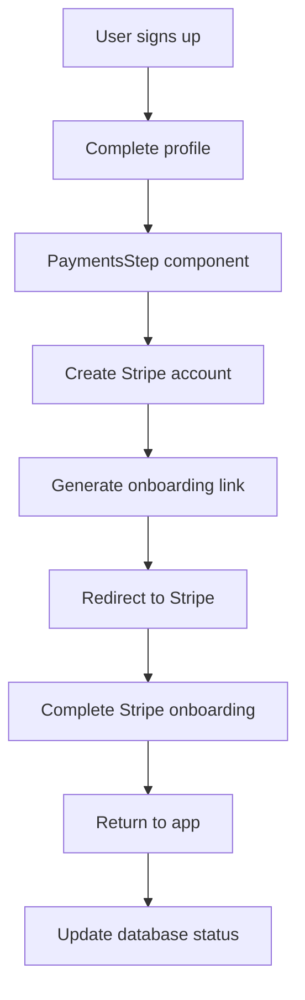
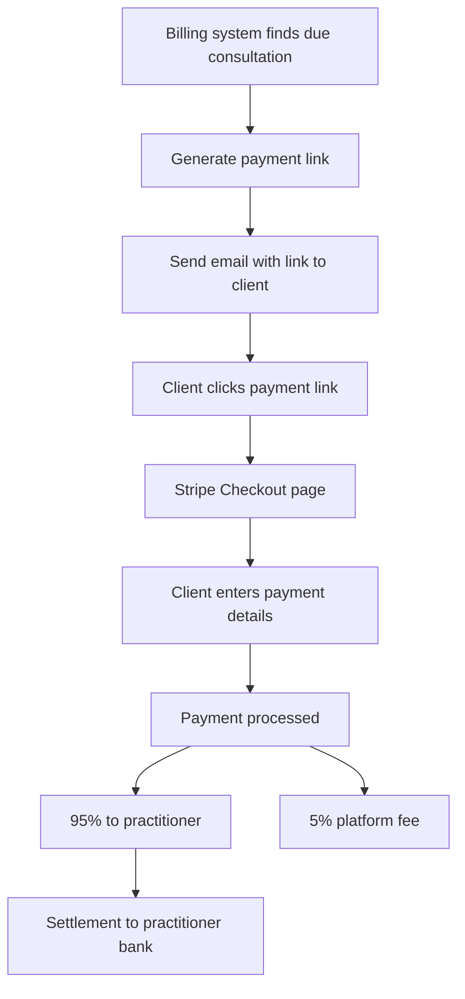

# Stripe Connect Integration Documentation

## 📋 Table of Contents

1. [Overview](#overview)
2. [Architecture](#architecture)
3. [Database Schema](#database-schema)
4. [API Endpoints](#api-endpoints)
5. [Payment Flow](#payment-flow)
6. [Configuration](#configuration)
7. [Testing](#testing)
8. [Troubleshooting](#troubleshooting)
9. [Security Considerations](#security-considerations)

---

## 🎯 Overview

Our Stripe Connect integration enables **multi-party payments** where:

- **Clients** pay for consultations
- **Practitioners** receive payments directly to their own Stripe accounts
- **Platform** takes a 5% fee from each transaction

### Key Features

✅ **Stripe Connect Express** - Simplified onboarding for practitioners
✅ **Direct Settlement** - Money flows directly to practitioners
✅ **Platform Fees** - Automatic 5% platform fee collection
✅ **Cross-Region Support** - Handles Spanish practitioners with international clients
✅ **Consultation Billing** - Integrated with email billing system

---

## 🏗️ Architecture

### Payment Flow Overview

```
Client Payment → Stripe Platform → Practitioner Account (95%) + Platform Fee (5%)
```

### Components

1. **Platform Account** (Main Stripe account)
    - Collects platform fees
    - Creates and manages connected accounts
    - Handles checkout sessions

2. **Connected Accounts** (One per practitioner)
    - Receives consultation payments
    - Managed via Stripe Express onboarding
    - Handles settlement in practitioner's country

3. **Integration Points**
    - Onboarding flow during user setup
    - Payment link generation for consultations
    - Email billing system integration

---

## 🗄️ Database Schema

### `stripe_accounts` Table

```sql
CREATE TABLE stripe_accounts (
    id UUID DEFAULT gen_random_uuid() PRIMARY KEY,
    user_id UUID REFERENCES profiles(id) ON DELETE CASCADE NOT NULL,
    stripe_account_id TEXT NOT NULL UNIQUE,
    onboarding_completed BOOLEAN DEFAULT FALSE,
    payments_enabled BOOLEAN DEFAULT FALSE,
    created_at TIMESTAMPTZ DEFAULT NOW(),
    updated_at TIMESTAMPTZ DEFAULT NOW()
);
```

### Key Fields

- **`user_id`** - Links to practitioner's profile
- **`stripe_account_id`** - Stripe's Connect account ID (e.g., `acct_1234567890`)
- **`onboarding_completed`** - Whether practitioner completed Stripe onboarding
- **`payments_enabled`** - Whether account can receive payments

### Indexes and Policies

```sql
-- Indexes for performance
CREATE INDEX idx_stripe_accounts_user_id ON stripe_accounts(user_id);
CREATE INDEX idx_stripe_accounts_stripe_account_id ON stripe_accounts(stripe_account_id);

-- RLS policies for security
CREATE POLICY "Users can view own stripe account" ON stripe_accounts
    FOR SELECT USING (auth.uid() = user_id);

CREATE POLICY "Users can insert own stripe account" ON stripe_accounts
    FOR INSERT WITH CHECK (auth.uid() = user_id);
```

---

## 🔌 API Endpoints

### Practitioner Onboarding

#### `POST /api/payments/stripe/create-account`

Creates a new Stripe Connect account for the authenticated user.

**Response:**

```json
{
	"success": true,
	"accountId": "acct_1234567890",
	"message": "Stripe account created successfully"
}
```

#### `POST /api/payments/stripe/onboarding-link`

Generates hosted onboarding link for Stripe Express setup.

**Response:**

```json
{
	"success": true,
	"onboardingUrl": "https://connect.stripe.com/express/onboarding/...",
	"expiresAt": "2025-01-20T10:00:00Z"
}
```

#### `GET /api/payments/stripe/onboarding-status`

Checks current onboarding status.

**Response:**

```json
{
	"onboarding_completed": true,
	"payments_enabled": true,
	"account_id": "acct_1234567890"
}
```

### Payment Processing

#### `POST /api/payments/stripe/create-checkout`

Creates checkout session for consultation payment (user-authenticated).

**Request Body:**

```json
{
	"bookingId": "uuid",
	"clientEmail": "client@example.com",
	"clientName": "Hugo Sanchez",
	"consultationDate": "2025-01-20",
	"amount": 80,
	"practitionerName": "Dr. Maria Gonzalez"
}
```

**Response:**

```json
{
	"success": true,
	"checkoutUrl": "https://checkout.stripe.com/c/pay/cs_test_..."
}
```

#### `POST /api/payments/stripe/create-checkout-internal`

Internal endpoint for server-to-server checkout creation (used by billing system).

**Headers:**

```
Authorization: Bearer [SUPABASE_SERVICE_ROLE_KEY]
```

### Testing Endpoints

#### `GET /api/dev/test-payment`

Tests complete payment flow for authenticated user.

---

## 💰 Payment Flow

### 1. Practitioner Onboarding (One-time)



### 2. Consultation Payment (Per transaction)



---

## ⚙️ Configuration

### Environment Variables

```bash
# Stripe Configuration
STRIPE_SECRET_KEY=sk_test_... # or sk_live_... for production
NEXT_PUBLIC_STRIPE_PUBLISHABLE_KEY=pk_test_... # or pk_live_...

# Base URL for redirect URLs
NEXT_PUBLIC_BASE_URL=http://localhost:3000 # or production URL

# Supabase (for database access)
NEXT_PUBLIC_SUPABASE_URL=https://your-project.supabase.co
SUPABASE_SERVICE_ROLE_KEY=eyJ... # For server-side operations
```

### Stripe Dashboard Configuration

1. **Enable Stripe Connect**
    - Go to Stripe Dashboard → Connect
    - Enable Express accounts
    - Configure branding and terms

2. **Webhook Configuration** (Future)
    - Set up webhooks for payment events
    - Configure endpoints for `payment_intent.succeeded`, etc.

3. **Country Support**
    - Ensure Spain (ES) is enabled for Express accounts
    - Configure supported payment methods

---

## 🧪 Testing

### Test Payment Flow

1. **Complete setup:**

    ```bash
    # Ensure user has completed onboarding
    curl http://localhost:3000/api/payments/stripe/onboarding-status
    ```

2. **Test payment link generation:**

    ```bash
    curl http://localhost:3000/api/dev/test-payment
    ```

3. **Test complete billing flow:**

    ```bash
    # Create test consultations
    curl http://localhost:3000/api/dev/seed-consultations

    # Dry run billing (preview emails)
    curl -X POST http://localhost:3000/api/billing/consultation \
      -H "Content-Type: application/json" \
      -d '{"dry_run": true}'

    # Send actual bills with payment links
    curl -X POST http://localhost:3000/api/billing/consultation
    ```

### Test Cards (Stripe Test Mode)

- **Successful payment:** `4242 4242 4242 4242`
- **Declined payment:** `4000 0000 0000 0002`
- **3D Secure:** `4000 0025 0000 3155`

### Test Scenarios

1. ✅ **New practitioner onboarding**
2. ✅ **Payment link generation**
3. ✅ **Successful payment processing**
4. ✅ **Cross-region settlement (ES practitioner)**
5. ✅ **Platform fee calculation (5%)**
6. ✅ **Email integration with payment links**

---

## 🔧 Troubleshooting

### Common Issues

#### "Stripe account not ready for payments"

**Problem:** `payments_enabled: false` in database
**Solution:**

```sql
UPDATE stripe_accounts
SET onboarding_completed = true, payments_enabled = true
WHERE user_id = 'your-user-id';
```

#### "Cannot create a destination charge for connected accounts in ES"

**Problem:** Missing `on_behalf_of` parameter
**Solution:** Already fixed in our implementation with:

```javascript
payment_intent_data: {
  on_behalf_of: practitionerStripeAccountId,
  transfer_data: { destination: practitionerStripeAccountId }
}
```

#### No payment links in emails

**Problem:** Database function missing practitioner info
**Solution:** Ensure `get_consultation_billing()` includes user details

### Debug Commands

```bash
# Check Stripe account status
curl http://localhost:3000/api/payments/stripe/onboarding-status

# Test Stripe connection
curl http://localhost:3000/api/dev/test-payment

# Check database function
SELECT * FROM get_consultation_billing('2025-01-20');
```

---

## 🔒 Security Considerations

### Authentication & Authorization

1. **User Authentication Required**
    - All payment endpoints require authenticated users
    - Practitioners can only access their own Stripe accounts

2. **Service Role Protection**
    - Internal endpoints use service role key verification
    - Prevents unauthorized payment link generation

3. **RLS Policies**
    - Database-level security for stripe_accounts table
    - Users can only view/modify their own records

### Data Protection

1. **Sensitive Data**
    - Stripe account IDs stored in database
    - No payment card data stored (handled by Stripe)
    - Client email addresses handled securely

2. **API Keys**
    - Secret keys never exposed to client
    - Publishable keys safe for frontend use
    - Service role keys restricted to server operations

### Production Considerations

1. **Webhook Verification**
    - Implement webhook signature verification
    - Handle payment status updates securely

2. **Error Handling**
    - Log payment failures for investigation
    - Graceful degradation for billing system

3. **Monitoring**
    - Track payment success rates
    - Monitor platform fee collection
    - Alert on failed payments

---

## 📚 Additional Resources

- [Stripe Connect Documentation](https://stripe.com/docs/connect)
- [Express Accounts Guide](https://stripe.com/docs/connect/express-accounts)
- [Destination Charges](https://stripe.com/docs/connect/destination-charges)
- [Cross-Border Payments](https://stripe.com/docs/connect/cross-border-payouts)

---

## 🔄 Future Enhancements

1. **Webhook Integration**
    - Real-time payment status updates
    - Automatic booking status changes

2. **Advanced Fee Management**
    - Variable platform fees per practitioner
    - Volume-based fee discounts

3. **Multi-Currency Support**
    - Support for multiple currencies
    - Automatic currency conversion

4. **Payout Management**
    - Custom payout schedules
    - Payout status tracking

5. **Analytics Dashboard**
    - Payment volume tracking
    - Revenue analytics for practitioners
    - Platform fee reporting
